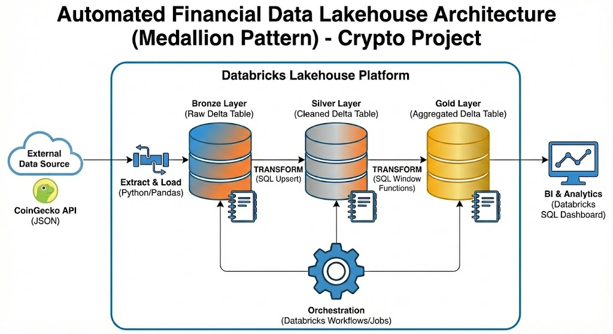

# Automated Financial Data Lakehouse (Crypto & Market Analysis)


## 📌 Executive Summary

This project implements a scalable **ELT (Extract, Load, Transform)** data pipeline using the **Databricks Lakehouse Platform**. It ingests historical and real-time cryptocurrency market data (Bitcoin, Ethereum, Solana) from the **CoinGecko API**, processes it through a **Medallion Architecture** (Bronze → Silver → Gold), and serves technical analysis metrics via a Databricks SQL Dashboard.

The goal is to demonstrate a production-grade data engineering workflow that decouples storage from compute, ensures data quality via schema enforcement, and automates financial analytics using **Delta Lake**.

---

## 🏗 Architecture

**Pattern:** Medallion Architecture (Bronze, Silver, Gold)  
**Platform:** Databricks (Community/Standard)  
**Orchestration:** Databricks Workflows

**Data Flow:**
`API Source` → `Bronze (Raw Ingestion)` → `Silver (Clean & Upsert)` → `Gold (Aggregated Metrics)` → `Dashboard`



---

## 🔧 Technical Implementation

### 1. Bronze Layer: Raw Ingestion
* **Source:** CoinGecko Public API.
* **Tech Stack:** Python, Pandas, PySpark.
* **Goal:** Land raw data as quickly as possible without modification.
* **Implementation:**
    * Fetches 365 days of historical prices.
    * Converts nested JSON responses into a Spark DataFrame.
    * **Load Strategy:** Appends raw data to the Delta Lake table `bronze_crypto_prices`.

### 2. Silver Layer: Data Cleaning & Quality
* **Tech Stack:** Spark SQL, Delta Lake.
* **Goal:** Create a trusted, clean dataset.
* **Implementation:**
    * **Deduplication:** Uses `MERGE INTO` (Upsert) to handle re-runs and ensure idempotency.
    * **Schema Enforcement:** Casts Unix timestamps to standard `DateType` and `TimestampType`.
    * **Data Quality:** Filters out `null` or corrupt records.

    ```sql
    MERGE INTO silver_crypto_prices AS target
    USING (SELECT * FROM bronze_crypto_prices WHERE price_usd IS NOT NULL) AS source
    ON target.coin_id = source.coin_id AND target.event_time = source.event_time
    WHEN MATCHED THEN UPDATE SET target.price_usd = source.price_usd
    WHEN NOT MATCHED THEN INSERT *;
    ```

### 3. Gold Layer: Business Aggregations
* **Tech Stack:** SQL (Window Functions).
* **Goal:** Calculate financial metrics for the dashboard.
* **Implementation:**
    * **7-Day Moving Average:** Smoothes out price action to identify trends.
    * **Daily Returns:** Calculates Day-over-Day growth using `LAG()`.
    * **Volatility:** Measures asset stability.

---

## 🚀 How to Run

1.  **Prerequisites:**
    * Databricks Workspace (Community Edition or Standard).
    * A generic compute cluster.

2.  **Deployment:**
    * Import the notebooks from the `/src` folder into your workspace.
    * **Notebook 1:** `01_Crypto_Bronze_Layer` (Python)
    * **Notebook 2:** `02_Crypto_Silver_Layer` (SQL)
    * **Notebook 3:** `03_Crypto_Gold_Layer` (SQL)

3.  **Orchestration:**
    * Create a **Databricks Job**.
    * Link the three notebooks as sequential tasks (Task 1 → Task 2 → Task 3).
    * Run the job manually or set a cron schedule.
    

4.  **Visualization:**
    * Go to **Basic_Crypto_Analytics**.

---

## 🧠 Key Skills Applied
* **Databricks Lakehouse:** Unified batch and streaming data processing.
* **Delta Lake:** Implemented ACID transactions and time travel.
* **ELT Strategy:** "Load first, Transform later" for faster ingestion and lineage preservation.
* **Advanced SQL:** Used Window Functions (`OVER`, `PARTITION`, `ROWS BETWEEN`) for time-series analysis.
* **Orchestration:** Automated pipeline execution with Databricks Workflows.

---

## 🔮 Future Improvements
* **Streaming:** Migrate Bronze ingestion to Spark Structured Streaming for real-time updates.
* **dbt Integration:** Move transformation logic to dbt for better version control and CI/CD.
* **Data Quality Testing:** Implement Great Expectations for rigorous data validation.
